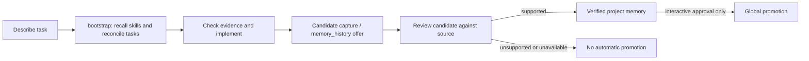
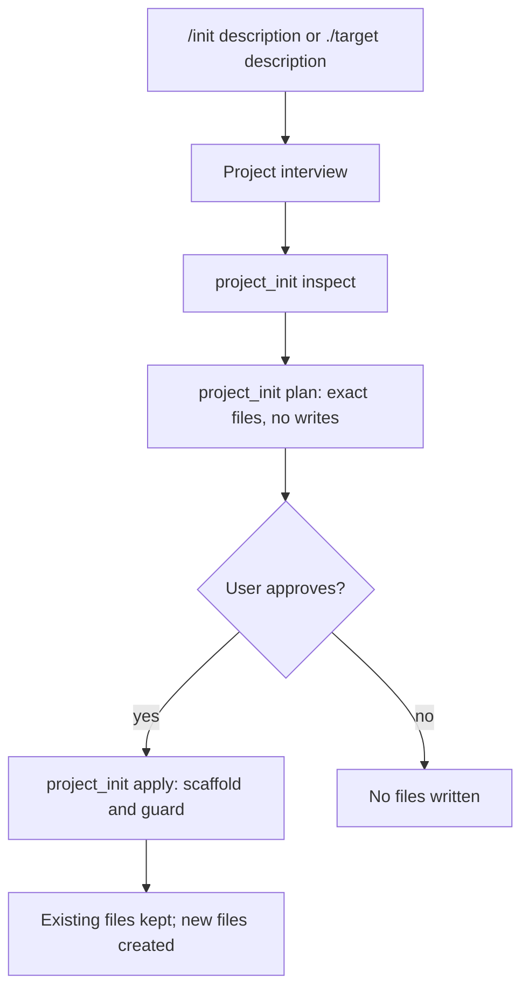

# Trebol v0.4.0

Trebol is Clover's internal harness and the successor to the original
Swarm Go agent harness. It brings the Swarm development model
to Pi as an extension pack: structured prompt and
context assembly, policy and hooks, durable state, tasks, subagents, skills,
research tools, parity checks, and a Swarm-oriented terminal experience.

> **Status:** Active development. The repository is evolving quickly and some
> interfaces are still experimental.

## Why this repository exists

We spent a long time building and using these capabilities in the Swarm SDK.
That work gave us a mature set of ideas—agents, tools, skills, hooks, policy,
tasks, memory, and verification—but it also meant maintaining a separate agent
runtime and user experience.

We decided to move the integration to **Pi**. Pi already provides the provider
and agent loop, session management, native tools, and terminal UI. Trebol now
adds the Swarm capabilities as extensions instead of maintaining a second agent
runtime. This keeps the boundary clear:

```text
Pi owns the agent loop, provider, sessions, native tools, and TUI
        ↓
Trebol extensions add Swarm context, policy, tools, state, and UI
```

The migration adapts the Swarm model to Pi's lifecycle and extension APIs;
obsolete parity probes were retired in v0.4.0.

## Capabilities

### Runtime and context

- Swarm system-prompt and context assembly with provenance and bounded inputs
- Hierarchical `AGENTS.md` discovery
- Plan mode, thinking controls, prompt-context configuration, and inspection
- Session startup and rehydration through Pi lifecycle events
- Runtime hooks, transport parity, cache telemetry, and update checks

### Tools and orchestration

- Bash, filesystem, patch, image-reading, search, and research tools
- Subagents through `Agent` and `AgentControl`
- Task creation, planning, blocking, notes, status, and run control
- Schedules, goals, loops, and wakeups
- MCP and vault adapters
- CodeMode for confined, composable tool workflows
- User questions and structured annoyance/defect reporting

### State and memory

- Durable session entries and conversation metadata
- Repository, worktree, and global memory scopes
- Evidence-backed candidate capture/review, PageIndex discovery, and
  bounded read-only retrieval; a candidate is not an established fact
- Bounded history search and retrieval with redaction
- Shared state that does not depend on what the TUI happens to render

### Policy and presentation

- Capability, workspace, mutation, network, and approval policy; `/init`
  scaffolding can install a workspace structure guard
- Disk hooks and policy nudges
- Pi-native tool renderers plus Swarm hook rows and widgets
- Conversation metrics, footer segments, themes, control-panel status, and
  the `/btw` side-question overlay

### Verification

- Unit tests, integration tests, build checks, and dogfood commands
- Architecture notes documenting the migration and the important seams

## How it works

Pi loads extensions from `.pi/extensions/` one level deep. The numeric layer
prefixes define load order:

| Layer | Responsibility |
| --- | --- |
| `00-runtime` | Integration boundary, hooks, runtime, transport, telemetry |
| `10-context` | Prompt assembly, context, plan mode, skills, thinking |
| `20-policy` | Disk hooks and policy nudges |
| `30-tools` | Agents, tasks, bash, filesystem, search, MCP, research, vault, and more |
| `40-state` | Memory history and conversation metadata |
| `50-ui` | Metrics, themes, status, control panel, and UI extensions |

Each layer has a `package.json` whose `pi.extensions` list is authoritative.
An extension registers with Pi using `registerTool`, `registerCommand`,
`registerShortcut`, or lifecycle handlers such as `session_start`,
`before_agent_start`, `tool_call`, and `tool_result`.

The implementation is split between thin Pi adapters and reusable packages:

```text
.pi/extensions/       Pi entrypoints and registration
.pi/lib/              Shared runtime, context, tool, state, and UI helpers
packages/             Reusable TypeScript packages grouped by capability
docs/architecture/    Living design and migration notes
docs/reference/       Feature audits and validation notes
tests/                Repository-level tests
tools/                Integration runners, install checks, and maintenance
vendor/               Read-only upstream references and submodules
```

Semantic state, authorization, persistence, and cancellation belong to the
runtime or state layers—not to rendered transcript text. UI code presents
state; it must not become the source of truth for that state.

## Repository map

| Path | Purpose |
| --- | --- |
| `.pi/extensions/` | Pi extension entrypoints, grouped by load layer |
| `.pi/lib/` | Shared implementation used by extensions |
| `.pi/test/` | Tests for Pi-specific code |
| `.pi/config/` | Project prompt and Swarm settings; credentials stay ignored |
| `.pi/themes/` | Local Pi themes |
| `packages/runtime/` | Core identity, contracts, runtime control, and bootstrap |
| `packages/context/` | Prompt assets, skills, and generated-skill lifecycle |
| `packages/policy/` | Capability and execution policy |
| `packages/tools/` | Agents, CodeMode, MCP, scheduling, and task management |
| `docs/` | Architecture, plans, references, and parity documentation |
| `artifacts/` | Ignored probe output, recordings, and baselines |
| `vendor/` | Read-only upstream source and reference submodules |

The repository operating contract is [AGENTS.md](AGENTS.md). Read it before
making changes; it describes extension inventory, capability ownership, safety
rules, and validation expectations.

## Getting started

### Requirements

- Node.js with npm workspaces support
- Git, including submodule support when working with vendored references
- Pi installed and available on your `PATH` for interactive use

Install dependencies:

```bash
npm install
```

Build the runtime packages:

```bash
npm run build:runtime
```

Build all packages:

```bash
npm run build
```

Pi discovers the project extensions from the repository's `package.json`:

```json
{
  "pi": {
    "extensions": [
      ".pi/extensions/00-runtime",
      ".pi/extensions/10-context",
      ".pi/extensions/20-policy",
      ".pi/extensions/30-tools",
      ".pi/extensions/40-state",
      ".pi/extensions/50-ui"
    ],
    "themes": [".pi/themes"]
  }
}
```

Start Pi from the repository root so the project extensions and hierarchical
context files are discovered:

```bash
pi
```

## Usage

Type these commands **inside Pi** (not in a shell). Begin with `/help` for Pi's
own commands; Trebol's commands below are provided by the extension pack in
this repository. Slash commands configure the session or open UI; for research,
edits, tasks, and memory retrieval, describe the work to the agent so it can
invoke the corresponding tools. Some panels require interactive `pi` rather
than headless `pi -p`.

### First task and memory

1. Describe your task normally, e.g. “Inspect the auth flow and plan a safe fix.”
   The agent's `bootstrap` tool selects relevant memory and up to two skills,
   then creates or reconciles tasks. Inspect its evidence before acting.
2. `/bootstrap status` reports strategy, model and readiness;
   `/bootstrap parallel|combined|off|reset` changes strategy and
   `/bootstrap model` opens a model selector. `/mem status|on|off` controls
   bootstrap enforcement. While enforcement is on, ordinary tool calls before
   bootstrap are blocked; `/mem off` is the recovery option if bootstrap fails.
   `Ctrl+D` toggles the session-only bootstrap requirement (shown in the footer).
3. `/tasks` opens the **read-only** task browser (interactive TUI). Ask the
   agent to use `TaskManage` for edits, dependencies and evidence-backed
   completion. `/memory-capture status|on|off` reports or changes session
   candidate extraction; `/memory-review` attempts review of one candidate
   with a single readable source reference. Other candidates may remain
   pending; an absent model or source evidence cannot establish a verified fact.
4. Ask the agent to `memory_history search` or `recall` with a task-specific
   query, or index a Markdown document with `context_index`, then use
   `context_outline` and `context_read` for cited sections. `/swarm-context`
   lists indexed sources and their staleness. To promote an **already verified**
   project record to global memory, use `/memory-promote repository ID`
   (or `worktree ID [namespace]`); this requires interactive confirmation and
   does nothing when declined. Never put secrets in memory.



### Start a project and configure your workspace

`/init a TypeScript CLI` starts a project interview in the current workspace;
`/init ./example a TypeScript CLI` selects a relative target directory. The
agent must call `project_init` to **inspect**, **plan** an exact file list, show
you that list and get approval before **apply**. Existing files are preserved;
an out-of-workspace target is rejected. The resulting structure policy blocks
unapproved paths. `/configure` opens a draft picker for prompt profiles,
context sources, skill/tool allowlists and workspace files; select **Apply**
to save or **Cancel** to discard. `/sp` selects/edits prompt profiles and
`/sp current` inspects the effective prompt. `/system` opens the prompt and
runtime inspector. `/skill` lists available skills; `/swarm-skills NAME` shows
one description (or lists skills if no matching name).



### Everyday commands

| Command | What to expect / important limit |
| --- | --- |
| `/btw Why did this test fail?` | Read-only side question using the current session as background. TUI and an active model are required; Escape aborts an active question or closes the overlay. |
| `/codemode` or `/codemode status|on|off|list` | Pick available tools, inspect mode or toggle CodeMode. `on` hides native tools while the bounded `codemode` tool remains available; `off` restores them. |
| `/supervisor status` or `/supervisor` | Inspect configuration/status (JSON in non-interactive mode) or open the TUI settings for optional Jev audit, operational review and memory worker. Workers need configured credentials/adapters; unavailable actions report an error rather than claiming completion. |
| `/vault list`, `/vault add [id]`, `/vault remove <id>` | List IDs/kinds, enter a global secret through UI prompts, or remove an entry. Add needs an interactive input UI; never paste credentials into chat or commit them. |
| `/hooks` or `/hooks GROUP on|off` | Inspect or change a known hook group; an unknown group reports an error. |
| `/goal CONDITION`, `/goal status|clear` | Persist a goal condition, inspect it, or clear it. An overlong condition is rejected. |
| `/loop [10m] TASK`, `/loop status|stop` | Schedule repeats in the current session; default interval is 10 minutes. Loops expire and are cancelled on shutdown/reload; use `scheduler` for delay/cron jobs. |
| `/trebol-update` or `/trebol-update install` | Check the release manifest or launch `pi update --extensions` and restart Pi afterward. Offline mode, manifest errors and launch failures are reported; this is not an in-place live reload. |
| `/swarm-autogen status|on|off|manual` | Show or change generated-skill mode; restart/reload to apply. |
| `/swarm-thinking` | Open Pi thinking-level selector (including off, low, medium, high); `Ctrl+Alt+Shift+T` opens the same picker. |
| `/swarm-mcp` or `/swarm-mcp discover SERVER` | Inspect configured MCP servers or discover server tools; requires an enabled server/connection. |
| `/metrics`, `/control-panel`, `/swarm-tools` | Show current conversation counters, durable agent/job status, or registered tools. |
| `/annoyed list`, `/annoyed read ID`, `/annoyed on|off` | Inspect recorded defect reports or toggle the annoyance reminder. A missing issue ID reports an error. |
| `/paste-image` | Paste a Windows clipboard bitmap into Pi's editor; non-Windows platforms use Pi's native paste behavior. |

Other inspection controls include `/plan-mode` (current plan state),
`/cache` (request-change telemetry, **not** provider cache-hit counts), and
`/swarm-runtime` (runtime/MCP status). `/swarm-websearch discover` initializes
the optional web-search MCP server; if its configuration or connection is
unavailable, use the `swarm-websearch` tool status or inspect the server config
rather than assuming search is working. These integrations are optional.

Use `/paseo status` and `/paseo setup` to inspect remote access before changing
anything; the explicit mutating step is `/paseo setup apply` (details below).
These are Trebol commands; Pi itself may offer additional commands such as
`/settings` and `/help`.

## Paseo remote access

On Linux, the Paseo extension starts an already-built daemon independently of
the current Pi session. New daemons default to `127.0.0.1:6767`; an explicit
`PASEO_LISTEN` override is honored. State is shared per user under
`$XDG_STATE_HOME/pi-swarm/paseo` (default `~/.local/state/pi-swarm/paseo`).

With Tailscale installed, logged in, and authorized to manage Serve, an explicit
`/paseo setup apply` discovers this machine's hostname, merges it into
`daemon.hostnames` in `$PASEO_HOME/config.json` (default `~/.paseo/config.json`),
hot-reloads Paseo, and configures a persistent **tailnet-only** HTTPS route.
No machine-specific hostname or manual JSON edit is needed for normal setup.
Ordinary Pi startup only starts/checks the daemon; it does not change config or
network exposure. Tool callers must explicitly supply `apply: true` to apply
setup; without it, `setup` and `serve` only inspect.
Existing unrelated config is preserved; conflicting Serve/Funnel routes are
reported rather than overwritten. Success requires HTTPS health and a WebSocket
hello/status/pong exchange, not merely an open port.

```text
/paseo status         # inspect the daemon
/paseo setup          # inspect without applying changes
/paseo setup apply    # retry automatic connection setup
```

For reboot-safe Linux startup, install the optional per-user systemd unit from
the repository root after Paseo has been built:

```bash
node tools/install/paseo-service.mjs install
systemctl --user daemon-reload
systemctl --user enable --now paseo.service
systemctl --user status paseo.service
```

The unit waits for `network-online.target`, checks that Tailscale is available,
keeps the daemon supervised with bounded restart backoff, and uses the same
`PASEO_HOME`/`PASEO_LISTEN` values as the extension. User lingering must be
enabled for startup without an interactive login (`loginctl enable-linger
"$USER"`). Inspect failures with `journalctl --user -u paseo.service -b`.
The unit starts Paseo itself; run `/paseo setup apply` separately when the
tailnet-only Serve route needs to be created or repaired.

Tailscale login/permissions remain prerequisites. This integration is not a
boot-time supervisor or a complete cross-platform installer. Fresh global Pi
package clones do not contain a built Paseo submodule; provision the Paseo build
before expecting automatic startup. Interrupted setup locks fail closed and
require inspection before removal. A working same-host connection does not prove
mobile roaming, machine reboot, or long-duration network-drop resilience.
Update/build operations refuse while a daemon record is live; stop it explicitly
first. Failed stops retain their records for recovery. Linux config writes use
verified directory descriptors; unrelated Serve ports, hosts, and services cause
setup to refuse rather than risk replacing them.
Serve changes use Tailscale's local API with `ETag`/`If-Match`; a concurrent
change is rejected rather than overwritten. Linux defaults to
`/var/run/tailscale/tailscaled.sock` (`TAILSCALE_SOCKET` can override it).
An unavailable API, missing ETag, or permission denial fails closed without
falling back to an unconditional Serve command.

## Development and validation

Run the focused test suite:

```bash
npm test
```

Run the repository dogfood path (build and tests):

```bash
npm run dogfood
```

Check installation health with:

```bash
npm run doctor
```

For migration design and validation boundaries, start with
[docs/architecture/modular-pi-architecture.md](docs/architecture/modular-pi-architecture.md),
[docs/architecture/swarm-tui-to-pi-map.md](docs/architecture/swarm-tui-to-pi-map.md),
and [docs/architecture/hooks-prompts-tools-pi-equivalence.md](docs/architecture/hooks-prompts-tools-pi-equivalence.md).

## Contributing

Changes should preserve the Pi/Swarm boundary and keep extensions thin:

1. Put domain logic in the appropriate package or `.pi/lib/` module.
2. Put registration and Pi lifecycle wiring in `.pi/extensions/`.
3. Put authorization and execution constraints in the policy layer.
4. Put rendering in the UI or render bridge, never in semantic state.
5. Update `AGENTS.md` and architecture notes when repository boundaries change.
6. Run the narrowest useful tests, then the broader validation relevant to the
   change.

Please include a clear description of the behavior changed, the commands run,
and any known validation gaps in pull requests.

## License and upstream references

This repository includes vendored upstream projects for reference and
integration. See the relevant license files and submodule metadata before
redistributing any upstream material. The repository's release metadata is
maintained in `package.json`, `CHANGELOG.md`, and `update-manifest.json`.
